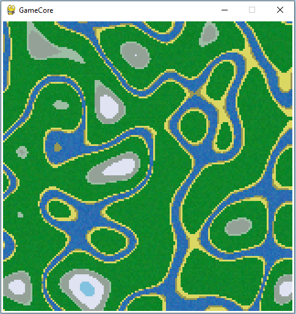
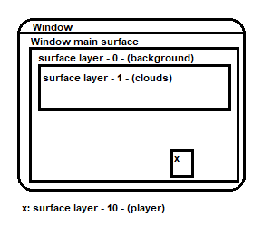

GameCore
========

This project is a Python game engine that uses Pygame library to provide a game loop, input handling, and game object management.

## requirements

---
    Python 3.5+
    pygame
    perlin-noise
    numpy
    pytmx

## external tools

- full [Tiled](https://www.mapeditor.org/) support by [pytmx](https://pytmx.readthedocs.io/en/latest/) with additional own support for native animation integration

## examples

> All those examples and more, are easily shown in the **__preview.py__**


> game example with player, meteoroid shader, tile map, animated tiles and a camera


> math projection


> procedural map generation with perlin noise and random

---

# How to use GameCore
## Core object

The ``Core`` class is responsible for creating the game window, managing the game loop, and handling input events. To use the ``Core`` object, simply create an instance of it and provide it with the necessary parameters:

```
Core(
    size=(640, 480),
    background_color=(255, 255, 255),
    fps=60
)
```

## simple runtime environment
Here is an example of how you can use the engine to create a simple game loop:

```
from core import *

def start(core): # <- here u get the core object
    # initialize game objects here
    pass

def update():
    # update game objects here
    pass

Core(update=update, start=start)
```
## what is an Engine?
The ``Engine`` class is a base class that you can inherit from to create your own custom runtime controlled object. Engines are started after the Core class has been invoked. The following methods are available for you to override:

- ``awake`` Is called once at the beginning to set properties.
- ``start`` Called once at the beginning or after first enable.
- ``on_enable`` Called when the engine has been enabled. This is the perfect method to pass params, to init or recalculate attributes.
- ``on_disable`` Called when the engine has been disabled.
- ``update`` Constantly called.
- ``fixed_update`` Called in a certain tick rate.
- ``on_destroy`` Called once after engine got destroyed

To create your own engine, you can simply inherit from the ``Engine`` class and override any of the above methods as necessary.

```
from core import *

class MyEngine(Engine):
    def start(self):
        print("MyEngine started")

    def update(self):
        print("MyEngine updated")

Core(background_color=(255, 255, 255, 0), fps=60)
```
### What is a Prefab Engine?
The lifecycle can be completely controlled and engines created dynamically via the parent ``Prefab``.

```
from core import *

class MyPrefab(Engine, Prefab):
    def start(self):
        print("MyPrefab started")
        
class MyEngine(Engine):
    def start(self):
        print("MyEngine started")
        self.core.instantiate(MyPrefab) # starts lifecycle

Core(background_color=(255, 255, 255, 0), fps=60)
```
### enable / disable Engine
`Engine`.*enable*(`**kwargs` *inject*...)
- ``inject`` You can pass properties to the `Engine`

`Engine`.*disable*()

```
from core import *

class MyPrefab(Engine, Prefab):
    def awake(self): # set pre configs
        self.is_enabled = False # Disable the start of the lifecycle at the instantiation and allow them to be enabled dynamically.

    def start(self):
        self.start_time = self.core.elapsed_delta_time
        print("MyPrefab started")

    def on_enable(self, inject=None):
        print("MyPrefab enabled")
        print(inject['info'])

    def on_disable(self):
        alive_time = self.core.elapsed_delta_time - self.start_time
        print("MyPrefab disabled after {}s".format(round(alive_time/1000)))

class MyEngine(Engine):
    def start(self):
        print("MyEngine started")
        self.prefab_engine = self.core.instantiate(MyPrefab)
        print("Wait three seconds...")
        self.wait_ms = 3000 # wait three seconds

    def update(self):
        self.wait_ms = self.wait_ms - self.core.delta_time
        if self.wait_ms <= 0 and not self.prefab_engine.is_enabled:
            self.prefab_engine.enable(info="This prefab will dies in 10 seconds. This is the perfect method to pass params, to init or recalculate attributes.")
            self.wait_ms = 10000
        if self.wait_ms <= 0 and self.prefab_engine.is_enabled:
            self.is_enabled = False
            self.prefab_engine.disable()


Core(background_color=(255, 255, 255, 0), fps=60)
```
Output:
```
MyEngine started
Wait three seconds...
MyPrefab enabled
This prefab will dies in 10 seconds. This is the perfect method to pass params, to init or recalculate attributes.
MyPrefab started
MyPrefab disabled after 10s
```

### destroy Engine
`Engine`.*destroy*(``Engine`` engine)
- ``engine`` The `Engine` to destroy, calls the `on_destroy`
```
from core import *

class MyEngine(Engine):
    def start(self):
        print("MyEngine started")
        self.core.destroy(self)

    def on_destroy(self):
        print("MyEngine stopped")
        exit()

Core(background_color=(255, 255, 255, 0), fps=60)
```
## Coroutine
The ``Coroutine`` class is a helper class that provides a way to execute a function at regular intervals. 
It is an optimal function to create health regeneration or enemy spawns, for example.
To use the ``Coroutine`` object, create an instance of it and provide it with the necessary parameters:

```
from core import *
class FooBar(Engine):
    def start(self):
        self.counter = 5
        self.start_coroutines([
            Coroutine(func=self.my_func, interval=1000, call_delay=1200, loop_condition=lambda: self.counter > 0) # runs my_func in 1200 ms every 1000 ms
        ])

    def my_func(self):
        print("Hello World")
        self.counter = self.counter - 1
        return {'interval': random.randint(1000, 2000)} # interval is optionally adjustable every tick

```

```
Output: 5x Hello World
```
## StateMachine
The ``StateMachine`` class is a finite state machine implementation that allows defining states and transitions between them, and activating a specific state based on its transitions conditions. 

> example: **__ai_town.py__**

> example 2: **__ai_simulation.py__**

- fog of war shader
- AI state machine
- coroutine for food interval spawn


## TileMap
The ``TileMap`` class is responsible for loading a ``.tmx`` file, which contains the information about the tileset and the map made of these tiles. It uses the ``pytmx`` library to load the ``.tmx`` file and render the tiles onto a surface. It also supports animated tiles. The ``make_map()`` method returns the rendered map surface and a list of animated tiles with their position and frames.

### Camera
The ``Camera`` class represents the viewable area of the game world. It takes a target position as input and sets its own position accordingly. The target is usually the player's position, and the camera follows the player around the game world. The ``look_at()`` method calculates the position of the camera based on the target position, and the ``apply()`` method returns the position of a rectangle in the camera view.

### TileMapDrawer
```
from core import *

class MyEngine(Engine):

    def start(self):
        self.tile_map_drawer = self.core.instantiate(TileMapDrawer) # create TileMapDrawer engine
        self.tile_map_drawer.enable(tile_map_path="map.tmx") # enable engine, load and draw map
        self.camera = self.tile_map_drawer.get_camera()
    
    def update(self):
        player_position = (player.x, player.y) # player position in world space not window space
        self.camera.look_at(player_position)
        self.core.window.blit(player_image, self.camera.apply_tuple(player_position)) # draw player sprite on camera

Core(background_color=(255, 255, 255, 0), fps=30)
```

> example: **__spaceship.py__**
## surface-layer draw system

In this super clear sketch, you can see that the layer draw system is based on the window provided by the pygame. The individual surfaces are layered with a priority, while they can have individual sizes.



To use the system, you have to create a new layer instance from the core object

```
self.surface = self.core.create_layer_surface( 
                name=None, # used to identify and edit the surface
                width=32, 
                height=32, 
                x=0, # pos.x
                y=0,  # pos.y
                render_layer: int = 0, 
                fill_after_draw=True # auto fill with core.background_color
        )
```

the surface is now automatically added to the system and displayed at the position (x,y) with (width,height). To display pixels or images on this surface, you can do this in the update method

```
def update(self):
    ...
    self.surface.blit(img, img_position) # shows the img on the surface, 
                                         # if the img has the size 32x32 (same like the surface), 
                                         # the img_position should be (0,0) to fill the surface perfect
```
## NavAgent

The `NavAgent` class is used for controlled approximation from one position to another. Ideal for players, enemies and everything that should move.

```
self.random_destination_position = (random.randint(0, self.core.window_size[0]), random.randint(0, self.core.window_size[1]))
self.agent = NavAgent(
        position=random_position, 
        speed=.75
    )
```

```
def update(self):
    self.agent.move(destination=self.random_destination_position)
    if self.agent.distance <= 1:
        # destination reached
```
## SpriteAnimator

With the `SpriteAnimator` you can animate a surface.
For example, to animate your player, the individual images of the animation must be entered into a `List`.
If several images are required per frame, this can easily be solved with a sub-`List`.
These methods can also be mixed.
The state names are required to control the animation.

```
def start(self):
    anim = [
        "state-name-1": [full_body_1_img, full_body_2_img, full_body_3_img],
        "state-name-2": [[body_1_img, hair_1_img], [body_2_img, hair_2_img]],
        "state-name-3": [full_body_1_img, [body_2_img, hair_2_img]]
    ]
    self.simpleSpriteAnimator = SimpleSpriteAnimator(
                            anim_sprites=anim, 
                            start_state='state-name-1', 
                            anim_state_decision=self.anim_sate_decision, 
                            sprite_size=(32,32), 
                            fps=.2
                    )
```
 
```
def anim_sate_decision(self): # Decide which animation should be played
    if(velocity < 1):
        return "state-name-1"
    else:
        if(jumping):
            return "state-name-2"
        else:
            return "state-name-3"
```

```
def update(self):
    surface = self.simpleSpriteAnimator.animate(self.core.delta_time)
    self.core.draw_surface(surface, draw_position)
```

## Core

```
core(
        title='GameCore',
        size=(480, 480),
        update=None,
        start=None,
        fixed_update=None,
        background_color=(0,0,0,0),
        fps=30,
        display=0,
        window_flags=pygame.DOUBLEBUF,
        window_depth=32
    )
```

### change window size

> core.window_size = (450, 450)

### surface-layer draw system

> get_layer_surface(self, name) -> pygame.Surface
    
> remove_layer_surface(self, name)

> move_layer_surface(self, name, position)
> 
> _move existing layer surface_

> create_layer_surface(self, name=None, width=0, height=0, x=0, y=0, render_layer: int = 0, fill_after_draw=True) -> pygame.Surface
> 
> _create auto draw surface with own render position_

### default surface methods

> create_surface(self, size=None) -> pygame.Surface
> 
> _this created surface, will not be automatically drawn, you need to make it per hand_

> draw_surface(self, surface, position=None)

### methods for the `Engine`

> get_engine_by_class(self, searchClass) -> Engine

> get_engines_by_class(self, searchClass) -> Engine[]

> instantiate(self, engine) -> Engine | None
> 
> _create engine while runtime_

> destroy(self, engine)