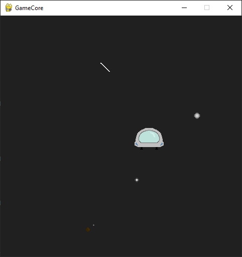
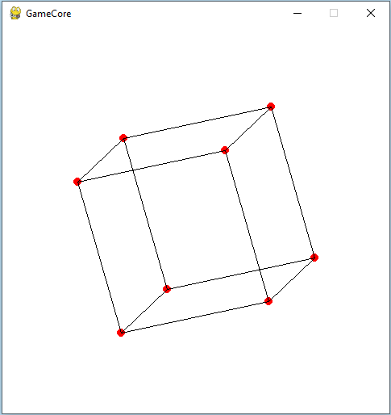
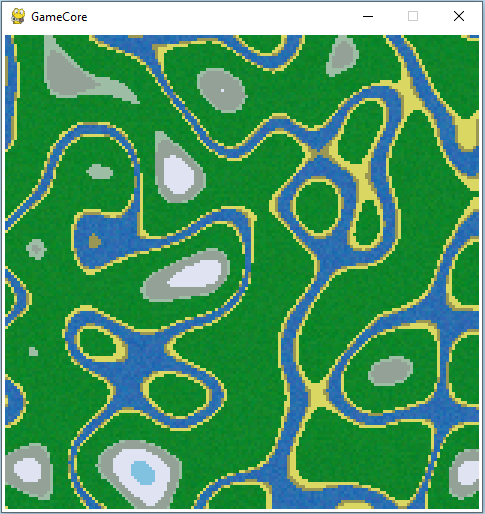

# GameCore

[](https://www.python.org/downloads/)
[](https://www.pygame.org/docs/)
[](https://pytmx.readthedocs.io/en/latest/)
[](https://readthedocs.org/projects/gamecore/)

A lightweight Python library designed to streamline the development of 2D games. GameCore provides core functionality for game loops, input handling, and rendering, allowing developers to focus on creating fun and engaging gameplay experiences.

---

## Features

- 🎮 **Simplified Game Loops**: Manage game states and updates with ease.
- ⌨️ **Input Handling**: Easily handle player input for a seamless experience.
- 🖼️ **2D Rendering**: Tools to render sprites and manage basic game objects.
- 🚀 **Beginner-Friendly**: Clear and simple APIs for quick prototyping.

---

### Requirements

    Python 3.5+
    pygame
    perlin-noise
    numpy
    pytmx

---

## Installation

```bash
pip install git+https://github.com/NiklasDerEchte/GameCore.git@master
```

---

## Examples

> All those examples and more, are easily shown in the **__preview.py__**


> game example with player, meteoroid shader, tile map, animated tiles and a camera


> math projection


> procedural map generation with perlin noise and random
 
---

## Documentation

The complete documentation is available at:

👉 https://readthedocs.org/projects/gamecore/