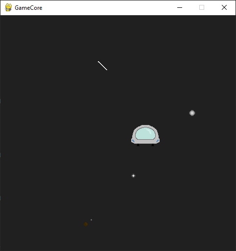
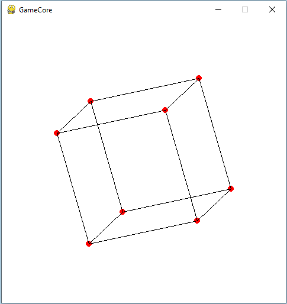
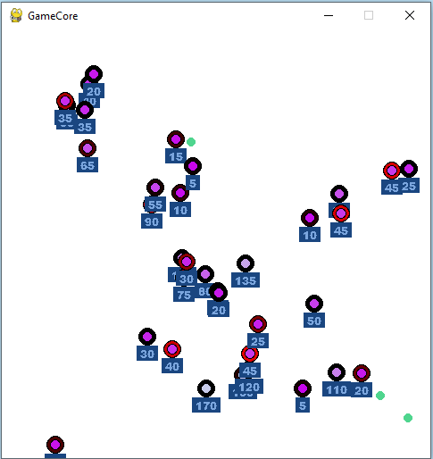

GameCore
========
This project is a Python game engine that uses Pygame library to provide a game loop, input handling, and game object management.

## Changes

---

### coroutine
#### <= v1.2:
```
self.coroutines = [
    Coroutine(self.old_foo_fn, 30)
]
```

#### \> v1.3:
```
self.start_coroutine(Coroutine(self.new_foo_fn, 30))
or
self.start_func_as_coroutine(self.new_foo_fn, interval=30)
```

## Requirements

---
    Python 3.5+
    Pygame library
    Perlin-Noise library
    Numpy library
    pytmx

## External Tools

- full [Tiled](https://www.mapeditor.org/) support by [pytmx](https://pytmx.readthedocs.io/en/latest/) with additional own support for native animation integration

## Examples




## How to Use

### Engine Object

The ``Engine`` class is a base class that you can inherit from to create your own custom engine. The following methods are available for you to override:

- ``awake`` Is called once at the beginning to set properties.
- ``start`` Called once at the beginning or after first enable.
- ``on_enable`` Called when the engine has been enabled.
- ``update`` Constantly called.
- ``fixed_update`` Called in a certain tick rate.

To create your own engine, you can simply inherit from the ``Engine`` class and override any of the above methods as necessary.

### Core Object

The ``Core`` class is responsible for creating the game window, managing the game loop, and handling input events. To use the ``Core`` object, simply create an instance of it and provide it with the necessary parameters:

```
Core(
    size=(640, 480),
    background_color=(255, 255, 255),
    fps=60
)
```

The ``size`` parameter is a tuple that specifies the size of the game window. The ``background_color`` parameter is a tuple that specifies the background color of the game window. The ``fps`` parameter specifies the frame rate of the game loop.

You can also provide optional parameters to the Core object:

- ``update`` A function that is constantly called during the game loop.
- ``start`` A function that is called once at the beginning or after first enable.
- ``fixed_update`` A function that is called in a certain tick rate.

### Coroutine Object

The ``Coroutine`` class is a helper class that provides a way to execute a function at regular intervals. To use the ``Coroutine`` object, create an instance of it and provide it with the necessary parameters:

```
from core import *
class FooBar(Engine):
    def start(self):
        self.counter = 5
        self.coroutines = [
            Coroutine(func=self.my_func, interval=1000, call_delay=1200, loop_condition=lambda: self.counter > 0) # runs my_func in 1200 ms every 1000 ms
        ] 

    def my_func(self):
        print("Hello World")
        self.counter = self.counter - 1
        # return {'interval': random.randint(1000, 2000)} # interval is optionally adjustable every tick

```

```
Output: 5x Hello World
```

### StateMachine
The ``StateMachine`` class is a finite state machine implementation that allows defining states and transitions between them, and activating a specific state based on its transitions conditions. 

> example: **__ai_town.py__**

> example 2: **__ai_simulation.py__**

- fog of war shader
- ai state machine
- coroutine for food interval spawn



## TileMapDrawer

### Tilemap

The ``TileMap`` class is responsible for loading a ``.tmx`` file, which contains the information about the tileset and the map made of these tiles. It uses the ``pytmx`` library to load the ``.tmx`` file and render the tiles onto a surface. It also supports animated tiles. The ``make_map()`` method returns the rendered map surface and a list of animated tiles with their position and frames.

### Camera

The ``Camera`` class represents the viewable area of the game world. It takes a target position as input and sets its own position accordingly. The target is usually the player's position, and the camera follows the player around the game world. The ``look_at()`` method calculates the position of the camera based on the target position, and the ``apply()`` method returns the position of a rectangle in the camera view.

```
from core import *

class MyEngine(Engine):

    def start(self):
        self.tile_map_drawer = self.core.get_engine_by_class(TileMapDrawer) # get TileMapDrawer engine
        self.tile_map_drawer.enable(True, tile_map_path="map.tmx") # enable engine, load and draw map
        self.camera = self.tile_map_drawer.get_camera()
    
    def update(self):
        player_position = (player.x, player.y) # player position in world space not window space
        self.camera.look_at(player_position)
        self.core.window.blit(player_image, self.camera.apply_tuple(player_position)) # draw player sprite on camera

Core(background_color=(255, 255, 255, 0), fps=30)
```

> example: **__spaceship.py__**

## Two Examples to use GameCore

Here is an example of how you can use the engine to create a simple game loop:

```
from core import *

def start():
    # initialize game objects here
    pass

def update():
    # update game objects here
    pass

Core(update=update, start=start)
```
You can also create your own custom engine by inheriting from the ``Engine`` class:

```
from core import *

class MyEngine(Engine):
    def start(self):
        print("MyEngine started")

    def update(self):
        print("MyEngine updated")

Core(background_color=(255, 255, 255, 0), fps=60)
```

## Code prefabs
The lifecycle can be completely controlled and engines created dynamically via the parent prefab.

```
from core import *

class MyPrefab(Engine, Prefab):
    def start(self):
        print("MyPrefab started")
        
class MyEngine(Engine):
    def start(self):
        print("MyEngine started")
        self.core.instantiate(MyPrefab) # starts lifecycle

Core(background_color=(255, 255, 255, 0), fps=60)
```

### Other Libraries

This project also uses the ``Perlin-Noise`` and ``Numpy`` libraries. These libraries are used for generating Perlin noise and manipulating arrays, respectively.

