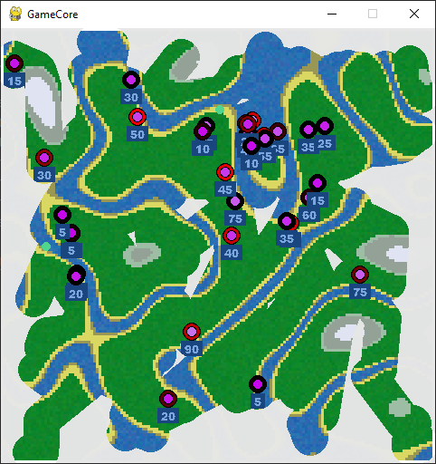

GameCore
========
This project is a Python game engine that uses Pygame library to provide a game loop, input handling, and game object management.


## Requirements
    Python 3.5+
    Pygame library
    Perlin-Noise library
    Numpy library

## How to Use

### Engine Object

The ``Engine`` class is a base class that you can inherit from to create your own custom engine. The following methods are available for you to override:

- ``awake`` Is called once at the beginning to set properties.
- ``start`` Called once at the beginning or after first enable.
- ``on_enable`` Called when the engine has been enabled.
- ``update`` Constantly called.
- ``fixed_update`` Called in a certain tick rate.

To create your own engine, you can simply inherit from the ``Engine`` class and override any of the above methods as necessary.

### Core Object

The ``Core`` class is responsible for creating the game window, managing the game loop, and handling input events. To use the ``Core`` object, simply create an instance of it and provide it with the necessary parameters:

```
Core(
    size=(640, 480),
    background_color=(255, 255, 255),
    fps=60
)
```

The ``size`` parameter is a tuple that specifies the size of the game window. The ``background_color`` parameter is a tuple that specifies the background color of the game window. The ``fps`` parameter specifies the frame rate of the game loop.

You can also provide optional parameters to the Core object:

- ``update`` A function that is constantly called during the game loop.
- ``start`` A function that is called once at the beginning or after first enable.
- ``fixed_update`` A function that is called in a certain tick rate.

### Coroutine Object

The ``Coroutine`` class is a helper class that provides a way to execute a function at regular intervals. To use the ``Coroutine`` object, create an instance of it and provide it with the necessary parameters:

```
from core import *
class FooBar(Engine):
    def start(self):
        self.counter = 5
        self.coroutines = [
            Coroutine(func=self.my_func, interval=1000, call_delay=1200, loop_condition=lambda: self.counter > 0) # runs my_func in 1200 ms every 1000 ms
        ] 

    def my_func(self):
        print("Hello World")
        self.counter = self.counter - 1

```

```
Output: 5x Hello World
```

### StateMachine
The ``StateMachine`` class is a finite state machine implementation that allows defining states and transitions between them, and activating a specific state based on its transitions conditions. 

example: **__ai_town.py__**

example 2: **__ai_simulation.py__**


### Other Libraries

This project also uses the ``Perlin-Noise`` and ``Numpy`` libraries. These libraries are used for generating Perlin noise and manipulating arrays, respectively.

## Two Examples to use GameCore

Here is an example of how you can use the engine to create a simple game loop:

```
from core import *

def start():
    # initialize game objects here
    pass

def update():
    # update game objects here
    pass

Core(update=update, start=start)
```
You can also create your own custom engine by inheriting from the ``Engine`` class:

```
from core import *

class MyEngine(Engine):
    def start(self):
        print("MyEngine started")

    def update(self):
        print("MyEngine updated")

Core(background_color=(255, 255, 255, 0), fps=60)
```

