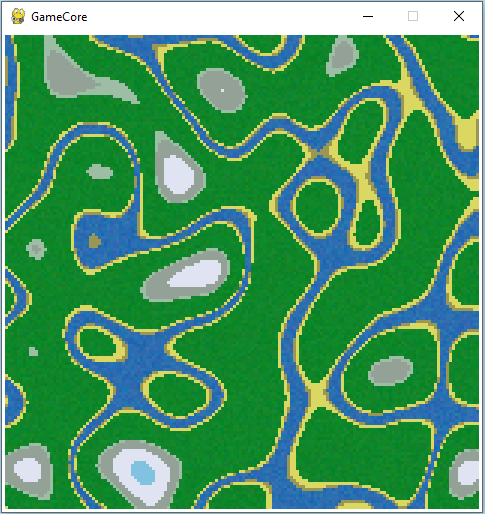

.. GameCore documentation master file, created by
   sphinx-quickstart on Wed Nov 27 18:46:16 2024.
   You can adapt this file completely to your liking, but it should at least
   contain the root `toctree` directive.

.. meta::
   :google-site-verification: I2IxJ6FXf5yD7T1OcSDMVSXwIqEZ0Aj2rHD70owkVGU

GameCore documentation
======================

This project is a `Python <https://docs.python.org/>`_ game engine that uses `PyGame <https://www.pygame.org/docs/>`_ library to provide a game loop, input handling, and game object management.
`GitHub <https://github.com/NiklasDerEchte/GameCore>`__

Examples
^^^^^^^^

All examples can be found in `preview.py <https://github.com/NiklasDerEchte/GameCore/blob/master/preview.py>`__

.. image:: _images/spaceship-example.png
   :alt: spaceship image
   :scale: 100%
   :target: tutorials/tilemap.html

.. image:: _images/projection-example.PNG
   :alt: math projection image
   :scale: 100%

.. toctree::
   :caption: Getting Started
   :glob:

   getting-started/installation
   getting-started/external-tools
   getting-started/basics
   getting-started/how-to-use

.. toctree::
   :caption: Tutorials
   :glob:

   tutorials/*

.. toctree::
   :caption: Reference
   :glob:

   reference/*