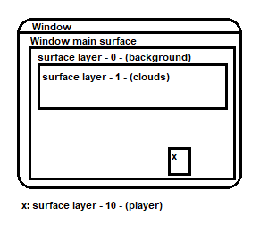

Drawing System with Animations
==============================

This tutorial demonstrates how to create and manage drawing systems in your game engine using custom surfaces, sprites, and animations. You will learn how to:

* Draw simple shapes or images.
* Handle animations with sprite slicing.
* Utilize directory-based sprite animations for more complex behaviors.

Surface and Sprite Overview
^^^^^^^^^^^^^^^^^^^^^^^^^^^

**Surface**:
A `Surface` is a fundamental 2D object in graphical programming, primarily used to represent an image or a drawable area. It serves as a canvas where graphics can be rendered, including shapes, text, or other images. In frameworks like Pygame, surfaces are often the building blocks for visual elements.

- Example: A surface might represent a game background or a texture for a game object.

**Sprite**:
A `Sprite` is an abstraction representing a visual object in a 2D space, often associated with a surface for its appearance. Sprites typically include additional features such as position, movement, and collision detection, making them essential for managing interactive objects in games.

- Example: A sprite could be a character, enemy, or collectible item in a game.

Surface Layer Draw System
^^^^^^^^^^^^^^^^^^^^^^^^^

The surface layer draw system is a class for organizing and rendering multiple surfaces in a specific order. Each surface is assigned to a layer, and the system ensures that surfaces are drawn sequentially from the background to the foreground based on their layer priority.

Each ``scene`` has its own ``SurfaceLayerDrawSystem``. The current system is accessible via the ``core`` object.

In this super clear sketch, you can see that the layer draw system is based on the window provided by the pygame. The individual surfaces are layered with a priority, while they can have individual sizes.

To use the system, you have to create a new layer instance from the core object

.. code-block:: python

    self.surface = self.core.create_layer_surface(
                    name=None, # used to identify and edit the surface
                    width=32,
                    height=32,
                    x=0, # pos.x
                    y=0,  # pos.y
                    render_layer: int = 0,
                    fill_after_draw=True # auto fill with core.background_color
            )

the surface is now automatically added to the system and displayed at the position (x,y) with (width,height). To display pixels or images on this surface, you can do this in the update method

.. code-block:: python

    def update(self):
        ...
        self.surface.blit(img, img_position) # shows the img on the surface,
                                             # if the img has the size 32x32 (same like the surface),
                                             # the img_position should be (0,0) to fill the surface perfect

Drawing a Simple Box
--------------------

To start, create a system to draw a simple blue box on the screen. The box will be rendered onto a custom surface.

.. code:: python

    from game_core.core import *

    class DrawSystemPrefab(Engine):
        """
        A simple drawing system that draws a static colored box on the screen.

        All examples in this file can be found in `preview.py`.
        """

        def start(self):
            """
            Initializes the drawing surface and creates a simple sprite (blue box).

            - Retrieves the window size from the core system.
            - Creates a layer surface where the sprite will be drawn.
            - Initializes a `SimpleSprite` with a blue color and positions it at (50, 50).
            """
            size = self.core.window_size
            self.surface = self.core.create_layer_surface(
                name="_MainDrawSurface",
                width=size[0],
                height=size[1],
                x=0,
                y=0,
                render_layer=0,
                fill_after_draw=True
            )

            self.blue_box_sprite = SimpleSprite(color=(54, 117, 221))
            self.blue_box_sprite.update_rect(
                self.blue_box_sprite.get_rect().move((50, 50))
            )

        def update(self):
            """
            Draws the blue box sprite onto the surface.

            - Blits the sprite's image onto the surface at its current position.
            """
            self.surface.blit(self.blue_box_sprite.get_image(), self.blue_box_sprite.get_rect())

Drawing an Image Sprite
-----------------------

Next, draw an image sprite centered on the screen. Use ``SimpleImageSprite`` for this purpose.

.. code-block:: python

    class DrawSystemImagePrefab(Engine):
        """
        A drawing system that draws an image sprite at the center of the screen.

        All examples in this file can be found in `preview.py`.
        """

        def start(self):
            """
            Initializes the drawing surface and loads an image sprite.

            - Retrieves the window size from the core system.
            - Creates a layer surface where the sprite will be drawn.
            - Loads an image sprite and positions it at the center of the window.
            """
            size = self.core.window_size
            self.surface = self.core.create_layer_surface(
                name="_MainDrawSurfaceImage",
                width=size[0],
                height=size[1],
                x=0,
                y=0,
                render_layer=0,
                fill_after_draw=True
            )
            self.image_sprite = SimpleImageSprite(os.path.join(LIB_DIR, "examples/assets/pixel-adventure/Main Characters/Ninja Frog/Idle/tile000.png"))
            coords = get_center(
                (size[0] / 2, size[1] / 2),
                self.image_sprite.get_rect().width,
                self.image_sprite.get_rect().height
            )
            self.image_sprite.update_rect(
                self.image_sprite.get_rect().move(coords)
            )

        def update(self):
            """
            Draws the image sprite onto the surface.

            - Blits the image onto the surface at its current position.
            """
            self.surface.blit(self.image_sprite.get_image(), self.image_sprite.get_rect())

Animating an Image
^^^^^^^^^^^^^^^^^^

With the ``SpriteAnimator`` you can animate a surface. For example, to animate your player, the individual images of the animation must be entered into a ``List``. If several images are required per frame, this can easily be solved with a sub-``List``. These methods can also be mixed. The state names are required to control the animation.

.. code-block:: python

    def start(self):
        anim = {
            "state-name-1": [full_body_1_img, full_body_2_img, full_body_3_img],
            "state-name-2": [[body_1_img, hair_1_img], [body_2_img, hair_2_img]],
            "state-name-3": [full_body_1_img, [body_2_img, hair_2_img]]
        }
        self.simpleSpriteAnimator = SimpleSpriteAnimator(
                                anim_sprites=anim,
                                start_state='state-name-1',
                                anim_state_decision=self.anim_sate_decision,
                                sprite_size=(32,32),
                                fps=.2
                        )

.. code-block:: python

    def anim_sate_decision(self): # Decide which animation should be played
        if(velocity < 1):
            return "state-name-1"
        else:
            if(jumping):
                return "state-name-2"
            else:
                return "state-name-3"

.. code-block:: python

    def update(self):
        surface = self.simpleSpriteAnimator.animate(self.core.delta_time)
        self.core.draw_surface(surface, draw_position)

Using multiple frames of an image
------------------------------------------

Create a sprite animation using multiple frames of an image. This example uses a sprite animator to animate an "idle" state.

.. code-block:: python

    class DrawSystemAnimationImagePrefab(Engine):
        """
        A drawing system that animates an image sprite and displays it on the screen.

        All examples in this file can be found in `preview.py`.
        """

        def start(self):
            """
            Initializes the drawing surface and sets up an animated sprite.

            - Retrieves the window size from the core system.
            - Creates a layer surface where the animated sprite will be drawn.
            - Loads an animation with multiple frames for a sprite and positions it at the center of the window.
            """
            size = self.core.window_size
            self.surface = self.core.create_layer_surface(
                name="_MainDrawSurfaceAnimationImage",
                width=size[0],
                height=size[1],
                x=0,
                y=0,
                render_layer=0,
                fill_after_draw=True
            )
            anim = {
                "idle": [SimpleImageSprite(os.path.join(LIB_DIR, "examples/assets/pixel-adventure/Main Characters/Ninja Frog/Idle/tile{:03}.png".format(index))).get_image() for index in range(11)]
            }
            self.simple_sprite_animator = SimpleSpriteAnimator(
                anim_sprites=anim,
                start_state="idle",
                anim_state_decision=self.anim_sate_decision,
                sprite_size=(32, 32),
                fps=2
            )
            coords = get_center(
                (size[0] / 2, size[1] / 2),
                self.simple_sprite_animator.get_rect().width,
                self.simple_sprite_animator.get_rect().height
            )
            self.simple_sprite_animator.update_rect(
                self.simple_sprite_animator.get_rect().move(coords)
            )

        def update(self):
            """
            Updates and draws the animated sprite onto the surface.

            - Blits the current frame of the animation onto the surface at its current position.
            """
            self.surface.blit(
                self.simple_sprite_animator.animate(self.core.delta_time),
                self.simple_sprite_animator.get_rect()
            )

        def anim_sate_decision(self):
            """
            Defines the animation state decision logic for the sprite animator.

            - In this case, always returns the "idle" state for animation.
            """
            return "idle"

Slicing Sprites for Animation
-----------------------------

Use sprite slicing to handle animations from a single sprite sheet.

.. code-block:: python

    """
    This module defines advanced drawing systems for rendering sliced animations,
    animations with paddings, and directory-based sprite animations.
    Each class provides unique functionality for managing sprite slicing and animation states.
    """

    class DrawSystemAnimationImageSlicedPrefab(Engine):
        """
        A drawing system that displays an animated sprite using sliced frames from a single sprite sheet.

        Methods:
            start(): Initializes the drawing surface and configures the sprite animator with sliced frames.
            update(): Plays the animation and renders the current frame on the surface.
            anim_sate_decision(): Determines the animation state, always returning "idle."
        """
        def start(self):
            """
            Initializes the drawing surface and configures the sprite animator with a sliced animation.

            Creates a rendering surface and loads an animation from a sprite sheet, slicing it into frames
            using a predefined number of columns. Positions the sprite at the center of the screen.

            Parameters: None
            Returns: None
            """
            size = self.core.window_size
            self.surface = self.core.create_layer_surface(
                name="_DrawSystemAnimationImageSliced",
                width=size[0],
                height=size[1],
                x=0,
                y=0,
                render_layer=0,
                fill_after_draw=True
            )
            anim = {
                "idle": SimpleImageSprite(os.path.join(LIB_DIR, "examples/assets/pixel-adventure/Main Characters/Ninja Frog/Idle (32x32).png"), slicer=AmountSlicer(cols=11)).get_image()
            }
            self.simple_sprite_animator = SimpleSpriteAnimator(
                anim_sprites=anim,
                start_state="idle",
                anim_state_decision=self.anim_sate_decision,
                sprite_size=(32, 32),
                fps=1
            )
            coords = get_center(
                (size[0] / 2, size[1] / 2),
                self.simple_sprite_animator.get_rect().width,
                self.simple_sprite_animator.get_rect().height
            )
            self.simple_sprite_animator.update_rect(
                self.simple_sprite_animator.get_rect().move(coords)
            )

        def update(self):
            """
            Renders the current frame of the sliced animation onto the surface.

            Uses the sprite animator to retrieve the next frame based on elapsed time and draws it on the surface.

            Parameters: None
            Returns: None
            """
            self.surface.blit(
                self.simple_sprite_animator.animate(self.core.delta_time),
                self.simple_sprite_animator.get_rect()
            )

        def anim_sate_decision(self):
            """
            Determines the animation state for the sprite animator.

            Always returns "idle" in this implementation.

            Parameters: None
            Returns:
                str: The current animation state ("idle").
            """
            return "idle"

Handling Slices with Paddings
-----------------------------

For sprite sheets with padding or gaps, include padding parameters in the slicing configuration.

.. code-block:: python

    class DrawSystemAnimationImageSlicedWithPaddingsPrefab(Engine):
        """
        A drawing system that displays an animated sprite using sliced frames from a sprite sheet with paddings.

        Methods:
            start(): Initializes the drawing surface and configures the sprite animator with sliced frames.
            update(): Plays the animation and renders the current frame on the surface.
            anim_sate_decision(): Determines the animation state, always returning "idle."
        """
        def start(self):
            """
            Initializes the drawing surface and configures the sprite animator with a sliced animation.

            Creates a rendering surface and loads an animation from a sprite sheet with paddings.
            The frames are sliced using specified paddings and gaps, and the sprite is centered on the screen.

            Parameters: None
            Returns: None
            """
            size = self.core.window_size
            self.surface = self.core.create_layer_surface(
                name="_DrawSystemAnimationImageSlicedWithPaddings",
                width=size[0],
                height=size[1],
                x=0,
                y=0,
                render_layer=0,
                fill_after_draw=True
            )
            anim = {
                "idle": SimpleImageSprite(os.path.join(LIB_DIR, "examples/assets/debug/image-with-padding.png"), slicer=AmountSlicer(
                    cols=3,
                    rows=3,
                    top_padding=2,
                    bottom_padding=2,
                    left_padding=2,
                    right_padding=2,
                    x_gap=2,
                    y_gap=2
                )).get_image()
            }
            self.simple_sprite_animator = SimpleSpriteAnimator(
                anim_sprites=anim,
                start_state="idle",
                anim_state_decision=self.anim_sate_decision,
                sprite_size=(32, 32),
                fps=.1
            )
            coords = get_center(
                (size[0] / 2, size[1] / 2),
                self.simple_sprite_animator.get_rect().width,
                self.simple_sprite_animator.get_rect().height
            )
            self.simple_sprite_animator.update_rect(
                self.simple_sprite_animator.get_rect().move(coords)
            )

        def update(self):
            """
            Renders the current frame of the sliced animation with paddings onto the surface.

            Uses the sprite animator to retrieve the next frame based on elapsed time and draws it on the surface.

            Parameters: None
            Returns: None
            """
            self.surface.blit(
                self.simple_sprite_animator.animate(self.core.delta_time),
                self.simple_sprite_animator.get_rect()
            )

        def anim_sate_decision(self):
            """
            Determines the animation state for the sprite animator.

            Always returns "idle" in this implementation.

            Parameters: None
            Returns:
                str: The current animation state ("idle").
            """
            return "idle"

Directory-Based Animation
-------------------------

``SpriteDirectoryAnimation`` simplifies creating animations by organizing sprite images from a directory. Just provide the main folder path and optionally use a slicer to split sprite sheets into frames.

This file structure exemplifies the required structure for the ``SpriteDirectoryAnimation``. Here, ``player-animation`` serves as the main directory, which should be passed as an absolute path. Additionally, a ``Slicer`` can be selected to map the files within the directory, as well as the files in its subdirectories relative to the folder.

.. code::

    player-animation
    ├── run.png
    ├── jump.png
    └── idle
        ├── idle-frame-1.png
        └── idle-frame-2.png

Finally, automate animation handling with a directory-based system. This allows for managing multiple animations conveniently.

.. code-block:: python

    class DrawSystemDirectoryAnimationImageSlicedPrefab(Engine):
        """
        A drawing system that displays animations loaded from a directory containing sprite sheets.

        Methods:
            start(): Initializes the drawing surface and configures the sprite animator with animations from a directory.
            update(): Plays the animation and renders the current frame on the surface.
            anim_sate_decision(): Determines the animation state based on the current internal timer.
        """
        def start(self):
            """
            Initializes the drawing surface and configures the sprite animator with animations from a directory.

            Creates a rendering surface and loads animations from sprite sheets in a specified directory.
            Each animation is sliced using a size-based slicer. The sprite is positioned at the center of the screen.
            The system alternates between "idle" and "run" states based on an internal timer.

            Parameters: None
            Returns: None
            """
            size = self.core.window_size
            self.surface = self.core.create_layer_surface(
                name="_DrawSystemDirectoryAnimationImageSliced",
                width=size[0],
                height=size[1],
                x=0,
                y=0,
                render_layer=0,
                fill_after_draw=True
            )
            sprite_dir_anim = SpriteDirectoryAnimation(os.path.join(LIB_DIR, "examples/assets/pixel-adventure/Main Characters/Ninja Frog"), slicer=SizeSlicer(width=32, height=32))
            anim = sprite_dir_anim.parse()
            anim["idle"] = anim["Idle"]
            anim["run"] = anim["Run (32x32)"]
            self.simple_sprite_animator = SimpleSpriteAnimator(
                anim_sprites=anim,
                start_state="idle",
                anim_state_decision=self.anim_sate_decision,
                sprite_size=(32, 32),
                fps=2
            )
            coords = get_center(
                (size[0] / 2, size[1] / 2),
                self.simple_sprite_animator.get_rect().width,
                self.simple_sprite_animator.get_rect().height
            )
            self.simple_sprite_animator.update_rect(
                self.simple_sprite_animator.get_rect().move(coords)
            )
            self._is_idle = True
            self._timer = 0

        def update(self):
            """
            Renders the current frame of the directory-based animation onto the surface.

            Uses the sprite animator to retrieve the next frame based on elapsed time and draws it on the surface.
            Alternates between "idle" and "run" states based on the internal timer.

            Parameters: None
            Returns: None
            """
            self.surface.blit(
                self.simple_sprite_animator.animate(self.core.delta_time),
                self.simple_sprite_animator.get_rect()
            )
            if self._is_idle:
                self._timer += self.core.delta_time
                if self._timer >= 5000:
                    self._is_idle = False
            else:
                self._timer -= self.core.delta_time
                if self._timer <= 0:
                    self._is_idle = True

        def anim_sate_decision(self):
            """
            Determines the animation state for the sprite animator.

            Alternates between "idle" and "run" states based on the internal timer.

            Parameters: None
            Returns:
                str: The current animation state ("idle" or "run").
            """
            if self._is_idle:
                return "idle"
            return "run"
