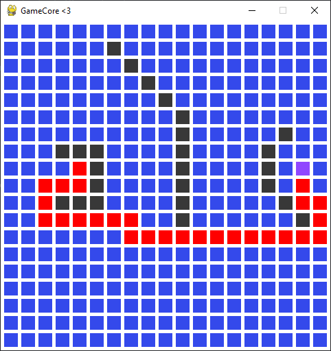

Navigation
==========

The ``Navigation`` section is about moving objects on the screen. It contains one class, ``NavAgent``, and information on how to implement ``Grid Navigation``.

Grid-Navigation
^^^^^^^^^^^^^^^

The ``Grid-Navigation`` is used for moving on a grid. Ideal for games like chess, checkers, etc.
With the built-in function ``a_star`` in ``GameCore``, navigation can be implemented in any grid system.

.. code-block:: python

    size = (300, 300) # grid size in cells
    grid = Grid(size) # a_star.py class

    location_a = (20, 2) # grid position, not a pixel position
    location_b = (10, 10)

    grid.get_node((15, 5)).set_accessibility(False) # set as "wall"
    ret = grid.get_path(grid.get_node(location_a), grid.get_node(location_b)) # returns a NodePath object
    print(ret.count())
    print(ret)

Purple: player | Red: path | Black: wall

* Example:
    `grid_navigation.py <https://github.com/NiklasDerEchte/GameCore/blob/master/game_core/examples/grid_navigation.py>`__

NavAgent
^^^^^^^^

The ``NavAgent`` class is used for controlled approximation from one position to another. Ideal for players, enemies and everything that should move.

.. code-block:: python

    self.random_destination_position = (random.randint(0, self.core.window_size[0]), random.randint(0, self.core.window_size[1]))
    self.agent = NavAgent(
            position=random_position,
            speed=.75
        )

.. code-block:: python

    def update(self):
        self.agent.move(destination=self.random_destination_position)
        if self.agent.distance <= 1:
            # destination reached

* Example:
    `SimulationAiUnit <https://github.com/NiklasDerEchte/GameCore/blob/master/game_core/examples/ai_simulation.py#L121>`__ in ``ai_simulation.py``