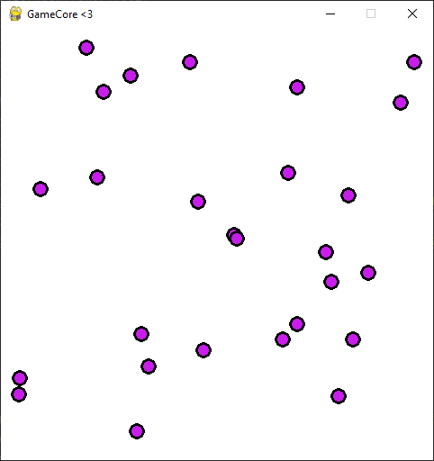
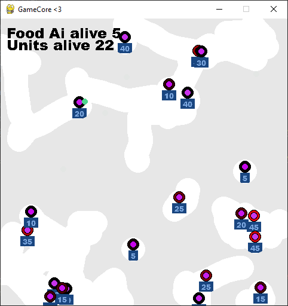

StateMachine
============

The ``StateMachine`` class is a finite state machine implementation that allows defining states and transitions between them, and activating a specific state based on its transitions conditions.

Examples
^^^^^^^^

`AI Town <https://github.com/NiklasDerEchte/GameCore/blob/master/game_core/examples/ai_town.py>`_
-------------------------------------------------------------------------------------------------

`code <https://github.com/NiklasDerEchte/GameCore/blob/master/game_core/examples/ai_town.py>`__

* AI state machine
* coroutine for food interval spawn

`AI Simulation <https://github.com/NiklasDerEchte/GameCore/blob/master/game_core/examples/ai_simulation.py>`_
-------------------------------------------------------------------------------------------------------------

`code <https://github.com/NiklasDerEchte/GameCore/blob/master/game_core/examples/ai_simulation.py>`__

* fog of war shader
* AI state machine
* coroutine for food interval spawn
